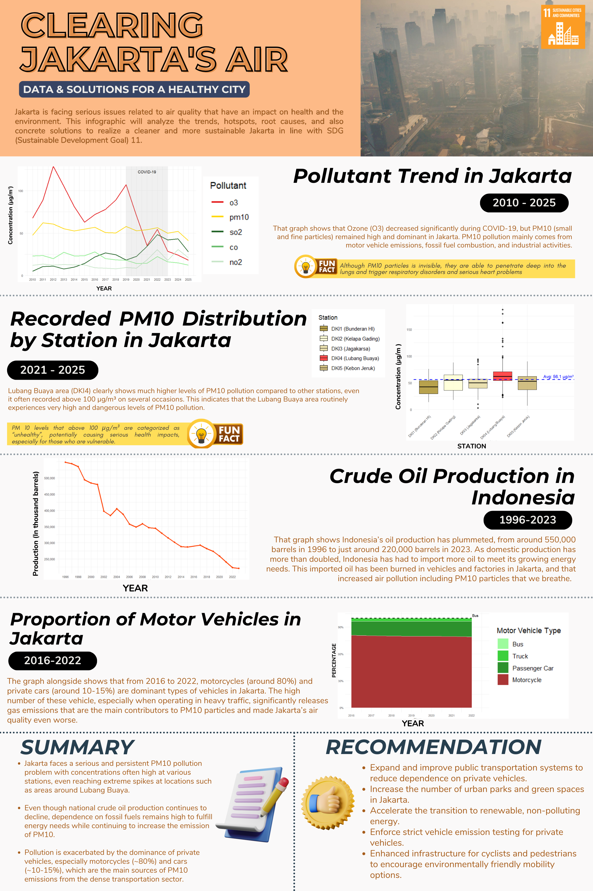

# Clearing Jakarta's Air: Data & Solutions for a Healthy City

An exploratory data analysis and visualization project investigating Jakarta's air pollution and its contributing factors, aligned with **SDG 11: Sustainable Cities and Communities**.

## Overview

This project analyzes air quality and transportation-related data to understand the persistence and distribution of air pollution in Jakarta. The analysis focuses particularly on PM10 and examines its trends over time, distribution across monitoring stations, and potential connections with transportation and fossil fuel dependence.

## Key Insights

- PM10 concentrations remained consistently high in Jakarta, even when other pollutants such as O3 declined during the COVID-19 period.
- Lubang Buaya recorded notably high PM10 concentrations compared with other monitoring stations.
- Motorcycles consistently accounted for more than 75% of registered motor vehicles in Jakarta between 2016 and 2022.
- Indonesia's crude oil production declined substantially from 1996 to 2023.

## Visualizations

### Pollutant Trend in Jakarta
Analyzes major pollutant concentrations from 2010–2025, including O3, PM10, SO2, CO, and NO2.

### PM10 Distribution by Station
Compares PM10 concentrations across five Jakarta monitoring stations from 2021–2025.

### Crude Oil Production in Indonesia
Visualizes Indonesia's crude oil production from 1996–2023.

### Motor Vehicle Composition in Jakarta
Shows the proportion of motorcycles, passenger cars, trucks, and buses from 2016–2022.

## Methodology

The project uses R for:

- Data preprocessing and cleaning
- Missing-value handling
- Data aggregation
- Grouping and filtering
- Exploratory data analysis
- Data visualization

Main libraries:

- `dplyr`
- `tidyr`
- `readr`
- `lubridate`
- `ggplot2`
- `scales`

## Data Sources

- Air Quality Index in Jakarta - Kaggle
- Jumlah Kendaraan Bermotor Menurut Jenis Kendaraan - BPS
- Produksi Minyak Bumi dan Gas Alam — BPS

## SDG Alignment

This project supports **SDG 11: Sustainable Cities and Communities**, particularly the goal of improving urban environmental quality and understanding air pollution in cities.
